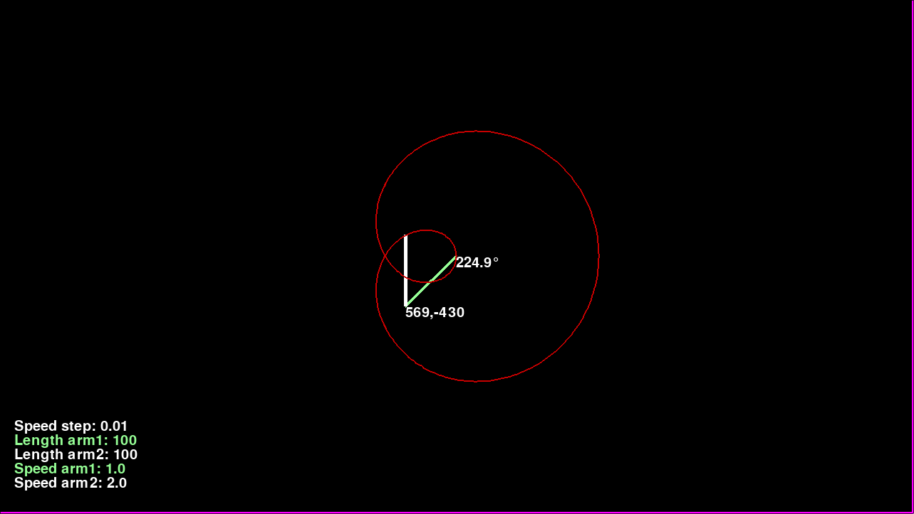
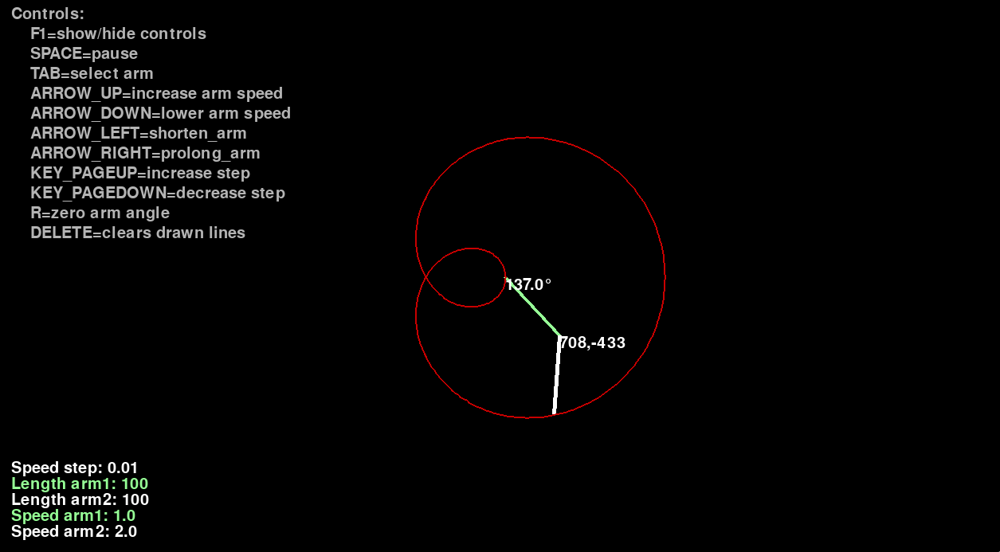

# epi-draw-py
 - Stupid toy which draws epicycle
 - Yes the controls are horrendous
 - Yes the graphics is crap and yes what you see swiping in the second window are vectors
<br>
</br>


Controls
===========================================================


Requirements
===========================================================
 - Python
 - Pygame (Will be downlaoded automatically)
 - Pip

Install
===========================================================

### Linux/Unix:

To install execute in terminal:
  ```
  git clone https://github.com/Sora-3e8/epi-draw-py
  ./venv_install.sh
  ```
To run: 
  ``` 
  ./main.py 
  ```

### Windows:

  Open cmd as administrator and run:
  ```
  git clone https://github.com/Sora-3e8/epi-draw-py
  start venv_install.bat
  ```
To run: 
  ``` 
  start launch.bat 
  ```


